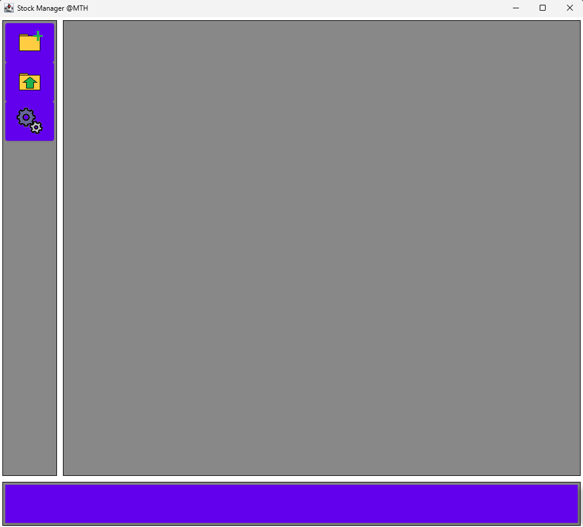
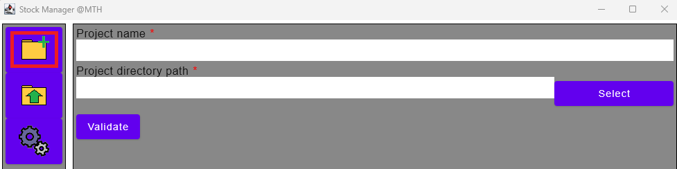
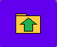
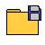

# About the project
The project allows you to create protfolios, stocks and add transaction to them to follow the evolution of your finances.
The main goal of the project is to add features I didn't see on other websites or trackers such as:
- Dividend cumulated value
- Tax cumulated value
- Difference of your current portfolio value VS your current portfolio value accounting dividend
- Manage several portfolio for free
- ...etc

The project is still in development but already usable.
Also, note that the project is mainly base on scrapping data from the website [Bourse Direct](https://www.boursedirect.fr). If you don't have acces to the website, note that most feature of the project won't really work for you at the moment.

# How it works (maybe not up to date)
## Starting the project
It will just create an install tree like this:
    .jar
    config
        sessionParameters.json
    history
- config contains the file sessionParameters.json wich is used to store global parameters of the application such as the language to use
- history is used to store csv containing stocks' histories downloaded from [Bourse Direct](https://www.boursedirect.fr) (or modifieed by yourself if you d'ont have access to the website in your country
At each start, it will check if the project is correctly installed and if not it will set it up again

The first screen you should see will look like this

# Getting started
## Create new project
Click on the button to create a new project then fill the inputs required:
- Project name
- Project directory path
It will save your project as a json named YOURPROJECTNAME.json in the specified directory

You'll then get redirected to the portfolio tab of your project and have full access to the menu.

## Load a project
If you want to load an already existing project just click on the following icon and select a valid json file.

# Menu
The menu should be on the left of the application and allow you to navigate threw it.
Here are the different buttons:
|Button|Function|
|--------|-------|
||View your project|
||Save your project|
||Create new project|
||Load a project|
||Close your project|
||Settings|